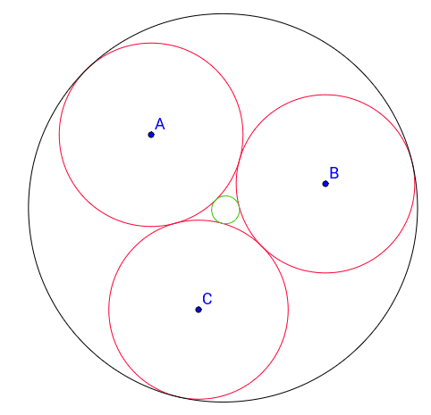
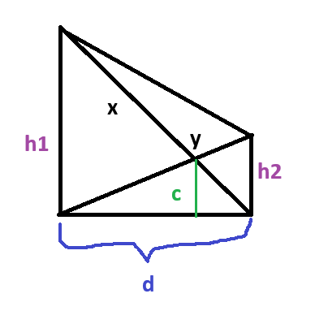

# Euclidean Geometry

`Conversions`

1 degree = 60 minutes <br>
1 radian = (pi/180) * degree <br>

`Arc & Chord on a Circle`

**Arc**   = r × θ          (θ must be in radians)<br>
**Chord** = 2 × r × sin(θ/2)

`Soddy Circles`
 


**Curvature** of a circle = `k = 1 / r`<br>
Given 3 mutually tangent circles with radii `r1`, `r2`, `r3` and curvatures `k1 = 1/r1`, `k2 = 1/r2`, `k3 = 1/r3`:

### Inner Soddy Circle (fits in the gap between the 3 circles)
```
k4 = k1 + k2 + k3 + 2 * sqrt(k1*k2 + k2*k3 + k3*k1)
r4 = 1 / k4
```

### Outer Soddy Circle (encloses all 3 circles)
```
k4 = k1 + k2 + k3 - 2 * sqrt(k1*k2 + k2*k3 + k3*k1)
r4 = 1 / |k4|
```
> Note: `k4` for the outer circle will be **negative** (or zero), so take the absolute value. If `k4_outer == 0`, it means the outer "circle" is a straight line (infinite radius).


## Trapezium


</br>
</br>


Formula | Notes |
---------|-------|
`1/c = 1/h1 + 1/h2`|Solve numerically|
`h₁ = √(x² - d²)` | Pythagorean theorem |
`h₂ = √(y² - d²)` | Pythagorean theorem |
Area, `A = (1/2)(d)(h₁ + h₂)` | After finding `d` |

---
> Use binary search for finding d.
```c++
C_cal = (h1 * h2) / (h1 + h2);

    if(C_cal > c) {lo = d; ans = lo;}
    else hi = d;
```