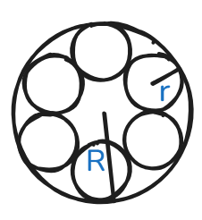
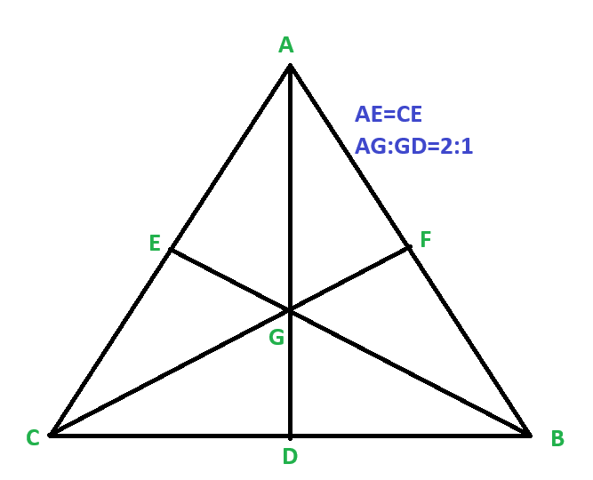
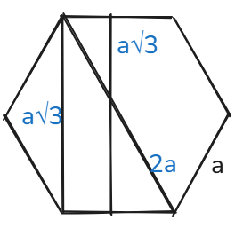
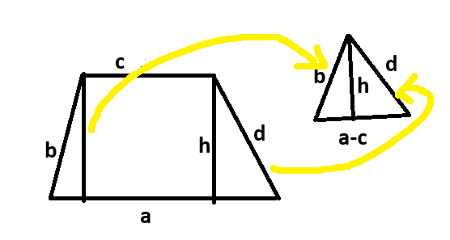
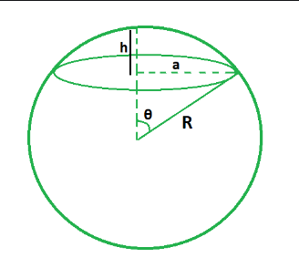
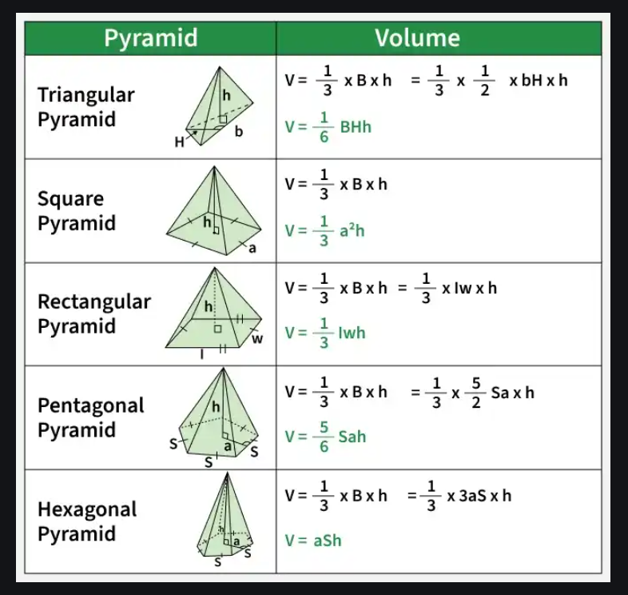
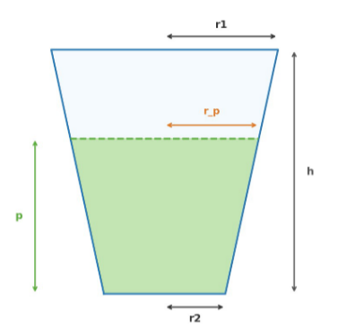

# Euclidean Geometry

`Regular Polygon`

Interior angle of regular polygon = ((n-2) * 180) / n.<br>
Circumradius of Any Regular Polygon = a / (2 * sin (pi/n)). <br>
Inradius of Any Regular Polygon = a / (2 * tan (pi/n))


`Conversions`

1 degree = 60 minutes <br>
1 radian = (pi/180) * degree <br>

`Arc & Chord on a Circle`

**Arc**   = r × θ          (θ must be in radians)<br>
**Chord** = 2 × r × sin(θ/2)

<br>

## Circle

`Soddy Circles/ Kissing Circle`
 


**Curvature** of a circle = `k = 1 / r`<br>
Given 3 mutually tangent circles with radii `r1`, `r2`, `r3` and curvatures `k1 = 1/r1`, `k2 = 1/r2`, `k3 = 1/r3`:

### Inner Soddy Circle (fits in the gap between the 3 circles)
```
k4 = k1 + k2 + k3 + 2 * sqrt(k1*k2 + k2*k3 + k3*k1)
r4 = 1 / k4
```

### Outer Soddy Circle (encloses all 3 circles)
```
k4 = k1 + k2 + k3 - 2 * sqrt(k1*k2 + k2*k3 + k3*k1)
r4 = 1 / |k4|
```
> Note: `k4` for the outer circle will be **negative** (or zero), so take the absolute value. If `k4_outer == 0`, it means the outer "circle" is a straight line (infinite radius).



If n small circle of same radius in big circle.
```
r = (R*sin(PI/n)) / (1+sin(PI/n))
```

<br>

## Triangle
## Median


<br>

### Properties
- The centroid `G` divides each median in the ratio 2 : 1 from the vertex.
- Each median divides the triangle into 2 triangles of equal area.
- All three medians together divide the triangle into 6 triangles of equal area, each equal to 1/6 of the total.

### Formula
`Median Length formula`
```
m_a = (1/2) * sqrt(2b² + 2c² - a²)
m_b = (1/2) * sqrt(2a² + 2c² - b²)
m_c = (1/2) * sqrt(2a² + 2b² - c²)
```
`Sum of Squares of Medians`
```
m_a² + m_b² + m_c² = (3/4)(a² + b² + c²)
```
`Perimeter Inequality`
```
(3/4)(a + b + c) < m_a + m_b + m_c < (a + b + c)
m_a + m_b > m_c.
```
`Area of Triangle from Medians`
```
s_m = (m_a + m_b + m_c) / 2

Area = (4/3) * sqrt( s_m * (s_m - m_a) * (s_m - m_b) * (s_m - m_c) )

Original Area =3/4​×(area of median triangle)
```

### Special Cases

| Triangle Type | Median Property |
|---------------|-----------------|
| Equilateral   | All three medians are equal; each is also the altitude, angle bisector, and perpendicular bisector |
| Isosceles     | The median from the apex equals the altitude and angle bisector |
| Right triangle | The median to the hypotenuse = half the hypotenuse |
---
<br>

## Hexagon



```
Area = (3*sqrt(3)/2) * a^2
```

## Trapezium


</br>
</br>


Formula | Notes |
---------|-------|
`1/c = 1/h1 + 1/h2`|Solve numerically|
`h₁ = √(x² - d²)` | Pythagorean theorem |
`h₂ = √(y² - d²)` | Pythagorean theorem |
Area, `A = (1/2)(d)(h₁ + h₂)` | After finding `d` |

---
> Use binary search for finding d.
```c++
C_cal = (h1 * h2) / (h1 + h2);

    if(C_cal > c) {lo = d; ans = lo;}
    else hi = d;
```
<br>

`Area of Trapezium using four sides`
<br>
<br>

<br>
For this you have to find area of triangle and then area of the rectangle.
solution of [LOJ_Trapezium](https://lightoj.com/problem/trapezium).
```c++
double a, b, c, d;
    cin >> a >> b >> c >> d;
    if (a < c) swap (a, c);

    double triBase = a-c;
    double s = (triBase + b + d) / 2.0;
    double triArea = sqrt (s * (s - triBase) * (s - b) * (s-d));
    double h = (2 * triArea) / triBase;
    double rectArea = c * h;

    cout << rectArea + triArea << endl;
```
## Sphere 



<br>

```
Volume of Sphere = (4/3) * PI * R^3
Spherical Cap Volume = (1/3) * PI*(3*R - h)h^2
```

## Pyramid
`Volume`
```
V =  1/3 * Area of Base * height.
```


## Frustum


<br>
<br>

`Formula`
```
r_p = r2 + (r1-r2) * p/h
V_p = (pi * p / 3) * (r2*r2 + r2*r_p + r_p*r_p)
```